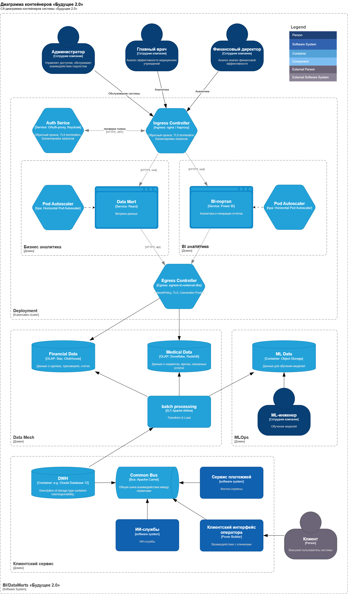
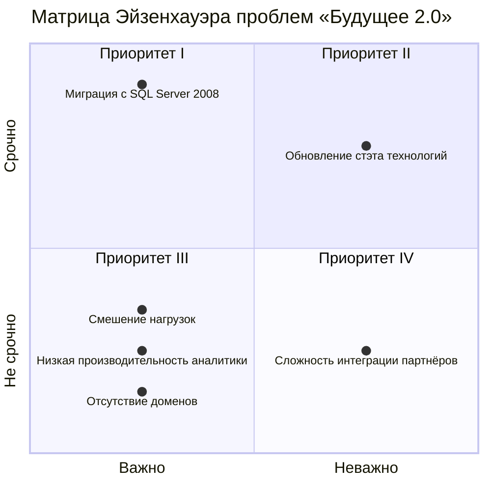

# Целевая архитектура и приоритизация «Будущее 2.0»

## Проблемные точки текущей архитектуры

| Проблемная область                                  | Описание проблемы                                                                                                                                                                                                                                                                                       | Затронутые бизнес-процессы                                                                                                                                                           |
| :-------------------------------------------------- | :------------------------------------------------------------------------------------------------------------------------------------------------------------------------------------------------------------------------------------------------------------------------------------------------------ | :----------------------------------------------------------------------------------------------------------------------------------------------------------------------------------- |
| 1. Монолитное хранилище данных (SQL Server 2008)    | Все данные и бизнес-логика сконцентрированы в единой устаревшей системе. Это создаёт единую точку отказа и критическое узкое место для всех операций.                                                                                                                                                   | Все аналитические и операционные процессы. Наблюдаются задержки в формировании отчётности, высокие затраты на разработку, ограниченная масштабируемость и повышенные риски простоев. |
| 2. Устаревший технологический стек                  | Используемый SQL Server 2008 более не поддерживается производителем, что создаёт серьёзные уязвимости в области информационной безопасности. Применение PowerBuilder как основного инструмента разработки осложняет поиск квалифицированных специалистов и увеличивает время вывода изменений на рынок. | Обеспечение безопасности и соответствия нормативным требованиям (compliance). Риск утечки конфиденциальных медицинских и финансовых данных. Замедление реализации новых функций.     |
| 3. Отсутствие чётких доменных границ                | Системы сильно связаны через общее хранилище. Модификации в одном функциональном блоке (например, финансовом) могут непреднамеренно нарушить логику смежных областей (например, медицинской отчётности).                                                                                                | Возможность независимого развития функциональных направлений. Высокая стоимость и длительность внесения изменений.                                                                   |
| 4. Низкая производительность аналитических запросов | Многоэтапные трансформации в монолитном DWH и обработка больших объёмов данных приводят к тому, что выполнение сложных аналитических запросов занимает часы.                                                                                                                                            | Процессы принятия управленческих решений. Руководители получают отчётность с существенной задержкой, что снижает качество и своевременность решений.                                 |
| 5. Совмещение операционной и аналитической нагрузки | Операционные приложения (интерфейсы операторов) и аналитические инструменты (BI) работают с одной базой данных, конкурируя за вычислительные ресурсы.                                                                                                                                                   | Качество обслуживания в операционных контурах. Запуск ресурсоёмких отчётов приводит к замедлению работы медицинского персонала в клиниках.                                           |
| 6. Высокая сложность подключения внешних партнёров  | Интеграция с внешними контрагентами (фармацевтические компании, производители оборудования) осуществляется через устаревшую шину Camel и монолитное DWH, что требует глубокого погружения в общую логику системы.                                                                                       | Скорость расширения партнёрской сети. Процесс подключения новых партнёров занимает неоправданно много времени и ресурсов.                                                            |

## Матрица приоритизации задач

### Приоритет I: Срочно, важно
> немедленное выполнение

Монолитное хранилище SQL Server 2008

- **Обоснование:** Критическая угроза непрерывности бизнеса, нарушение требований информационной безопасности, блокирование развития всех направлений.
- **Срок реализации:** 3–6 месяцев
- **Ожидаемый эффект:** Устранение точки отказа, повышение отказоустойчивости, обеспечение соответствия нормативным требованиям.

### Приоритет II: Срочно, не важно
> плановые работы в начале очереди

**Устаревший технологический стек**

- **Обоснование:** Неподдерживаемые решения создают уязвимости безопасности, невозможность оперативного реагирования на инциденты.
- **Срок реализации:** 6–12 месяцев (параллельно с миграцией хранилища)
- **Ожидаемый эффект:** Снижение рисков утечки данных, улучшение поддерживаемости, привлечение квалифицированных специалистов.

### Приоритет III: Важно, но не срочно
> плановые работы

**Низкая производительность аналитики**

- **Обоснование:** Прямое влияние на эффективность управления и принятия решений. Является следствием монолитной архитектуры.
- **Срок реализации:** 6–9 месяцев (в рамках миграции на новую архитектуру)
- **Ожидаемый эффект:** Сокращение времени формирования отчетов с 4–12 часов до 15–30 минут.

**Смешение операционных и аналитических нагрузок**

- **Обоснование:** Негативное влияние на качество сервиса для конечных пользователей (операторов клиник).
- **Срок реализации:** 6–9 месяцев (в рамках разделения архитектуры)
- **Ожидаемый эффект:** Обеспечение предсказуемой производительности операционных систем, независимость аналитических запросов.

**Отсутствие доменных границ**

- **Обоснование:** Стратегическая задача для обеспечения независимого развития бизнес-направлений.
- **Срок реализации:** 12–18 месяцев (постепенная трансформация)
- **Ожидаемый эффект:** Возможность параллельной разработки, снижение стоимости изменений, ускорение поставки новых функций.

### Приоритет IV: Не срочно и не важно
> занести в бэклог

**Сложность интеграции новых партнёров**

- **Обоснование:** Является симптомом фундаментальных проблем (монолитное хранилище, отсутствие доменных границ). Автоматически решается при реализации решений из Квадрантов 1 и 2.
- **Рекомендация:** Не выделять отдельные ресурсы на решение данной проблемы. Фокус на устранение корневых причин.
- **Ожидаемый эффект:** Сокращение сроков интеграции партнеров до 2–4 недель после реализации основных архитектурных изменений.