# Домены и потоки данных

## Поток данных системы «Будущее 2.0»

```mermaid
---
title: Диаграмма потока данных «Будущее 2.0»
---
flowchart LR
    Patient(["Клиент"]) -- Запросы, данные пациента --> ClientService["Клиентский сервис"]
    Patient -- Платежи --> PaymentService["Сервис платежей"]
    ClientService -- События клиентов, услуги --> CommonBus["Common Bus / Camel"]
    PaymentService -- Транзакции, счета --> CommonBus
    CommonBus -- Сырые события --> DWH[("DWH")]
    %%DWH -- Загрузка --> BatchProcess["Batch Processing / Airflow"]
    CommonBus -- Загрузка --> BatchProcess["Batch Processing / Airflow"]
    BatchProcess -- Данные для ML --> MLStorage[("ML Data / Object Storage")]
    BizAnalytics["Бизнес-аналитика"] -- Отчёты --> ChiefDoctor(["Главный врач"])
    BIPortal["BI-портал / Power BI"] -- Отчёты --> FinDirector(["Финансовый директор"])
    MLStorage -- Обучающие данные --> MLOpsProcess["MLOps"]
    MedicalDB[("Medical Data<br>Snowflake/Redshift")] -- Агрегированные данные --> BizAnalytics0["Анонимизация данных<br>Redshift DDM"]
    BizAnalytics0 -- Анонимизированные мед. данные --> BizAnalytics
    FinancialDB[("Financial Data<br>ClickHouse")] -- Очищенные данные --> BIPortal
    BatchProcess -- Финансовые данные --> FinancialDB
    BatchProcess -- Медицинские данные --> MedicalDB
    MLOpsProcess -- Токены, векторы --> n3(["ML-инженер"])

     Patient:::external
     ClientService:::process
     PaymentService:::process
     CommonBus:::process
     DWH:::storage
     BatchProcess:::process
     MLStorage:::storage
     BizAnalytics:::process
     BizAnalytics0:::process
     ChiefDoctor:::external
     BIPortal:::process
     FinDirector:::external
     MLOpsProcess:::process
     MedicalDB:::storage
     FinancialDB:::storage
     n3:::external
    classDef external fill:#e1f5fe,stroke:#01579b
    classDef process fill:#fff3e0,stroke:#ff6f00
    classDef storage fill:#f3e5f5,stroke:#4a148c
```

* [Диаграмма потока данных «Будущее 2.0»](Future20-DFD.png)

## Анализ целевой архитектуры и выделение бизнес-доменов

Анализ процессов «Будущее 2.0» приел к выделению бизнес-доменов, которые должны развиваться независимо, без необходимости модификации централизованного хранилища данных (DWH). Такой подход соответствует принципам Data Mesh и микросервисной архитектуры, где каждый домен владеет своими данными и предоставляет их через стандартизированные интерфейсы.

### Выделенные домены

| Домен                                      | Описание                                                                                                                                    | Бизнес-сценарии                                                                                             |
| ------------------------------------------ | ------------------------------------------------------------------------------------------------------------------------------------------- | ----------------------------------------------------------------------------------------------------------- |
| **Клиентский домен** (Customer Domain)     | Отвечает за взаимодействие с конечными пользователями и операторами клиник. Управляет личными кабинетами, записью на прием, коммуникациями. | Запись на прием, просмотр медицинской карты, получение уведомлений, работа операторов с пациентами          |
| **Медицинский домен** (Medical Domain)     | Обрабатывает данные, связанные с оказанием медицинских услуг: информацию о пациентах, врачах, историях болезней, проведенных процедурах.    | Анализ эффективности медучреждений, формирование статистики по услугам, ведение электронных медкарт         |
| **Финансовый домен** (Financial Domain)    | Управляет финансовыми операциями: платежами, счетами, транзакциями, финансовой отчётностью.                                                 | Обработка платежей, выставление счетов, анализ финансовой эффективности, формирование финансовой отчётности |
| **Аналитический домен** (Analytics Domain) | Обеспечивает подготовку и предоставление аналитических отчётов для руководства и бизнес-пользователей. Агрегирует данные из других доменов. | Генерация управленческой отчётности, мониторинг KPI, ad-hoc аналитика                                       |
| **MLOps домен** (MLOps Domain)             | Занимается разработкой, обучением и эксплуатацией моделей машинного обучения. Использует данные из других доменов для построения прогнозов. | Прогнозирование загрузки клиник, выявление аномалий в цепочках событий, рекомендательные системы            |

### Инфраструктурные компоненты
Элементы, обеспечивающие взаимодействие и общую функциональность, не являются самостоятельными бизнес-доменами, но необходимы для работы всей системы:
- **Common Bus (Apache Camel)** – шина для асинхронного обмена событиями между доменами.
- **Batch processing (Apache Airflow)** – оркестрация пакетных загрузок и трансформаций данных.
- **Egress Controller** – управление исходящим трафиком к внешним системам (например, базам данных за пределами кластера).
- **Pod Autoscaler** – автоматическое масштабирование подов в Kubernetes.
- **DLH** (возможно, Data Lake House) – централизованное хранилище для сырых данных, но в целевой архитектуре оно может использоваться как промежуточный слой, а не как единая точка изменения логики.

### Обоснование разделения на домены

#### Функциональные преимущества
> Преимущества для бизнеса

- **Ускорение вывода новых продуктов**  
  Команды могут параллельно разрабатывать и развертывать изменения без блокировок со стороны общего DWH. Например, запуск нового партнёрского сервиса в клиентском домене не требует согласования с финансовым доменом, если не затрагивает платежи.

- **Снижение зависимости от монолитного DWH**  
  Исчезает «единая точка отказа» и узкое место производительности. Каждый домен управляет своими данными, что повышает отказоустойчивость системы в целом.

- **Возможность независимого масштабирования**  
  При росте нагрузки на медицинскую отчётность можно масштабировать только соответствующий компонент, не затрагивая остальные домены.

- **Упрощение внедрения новых технологий**  
  В каждом домене можно использовать наиболее подходящий стек (например, Kafka для событий, Airflow для пакетной обработки, Kubernetes для оркестрации) без необходимости унификации.

- **Повышение качества данных**  
  Владельцы доменов несут ответственность за качество своих данных, что стимулирует внедрение практик Data Governance и Data Quality на местах.

#### Нефункциональные преимущества
> Атрибуты качества

1. **Независимость изменений**  
   Изменения в медицинских протоколах или форматах электронных карт не должны влиять на финансовые расчёты. Например, добавление новой услуги в медицинском домене требует только локальных изменений и публикации события через шину; финансовый домен самостоятельно обрабатывает это событие для выставления счетов. Это устраняет необходимость модификации общего DWH.

2. **Разные темпы развития**  
   Клиентский интерфейс может обновляться еженедельно (A/B-тестирование, улучшение UX), тогда как изменения в финансовых алгоритмах происходят реже и требуют строгого compliance. Разделение позволяет каждой команде работать в своём ритме.

3. **Специфические требования к данным**  
   Медицинские данные подчиняются особым нормам конфиденциальности (GDPR, HIPAA), а финансовые – требованиям аудита и безопасности (PCI DSS). Хранение и обработка в отдельных доменах упрощает обеспечение соответствия.

4. **Оптимизация производительности**  
   Медицинская аналитика (например, поиск по историям болезней) может эффективно работать на колоночных СУБД типа Redshift, а финансовая отчётность – на ClickHouse, оптимизированном для агрегаций. Независимые домены позволяют выбирать лучшие технологии под конкретные задачи.

5. **Автономность команд**  
   Каждый домен может развиваться отдельной кросс-функциональной командой (включая разработку, тестирование, эксплуатацию), что снижает координационные издержки и ускоряет вывод продуктов на рынок.
