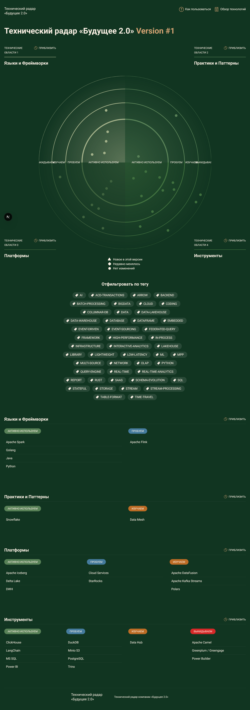
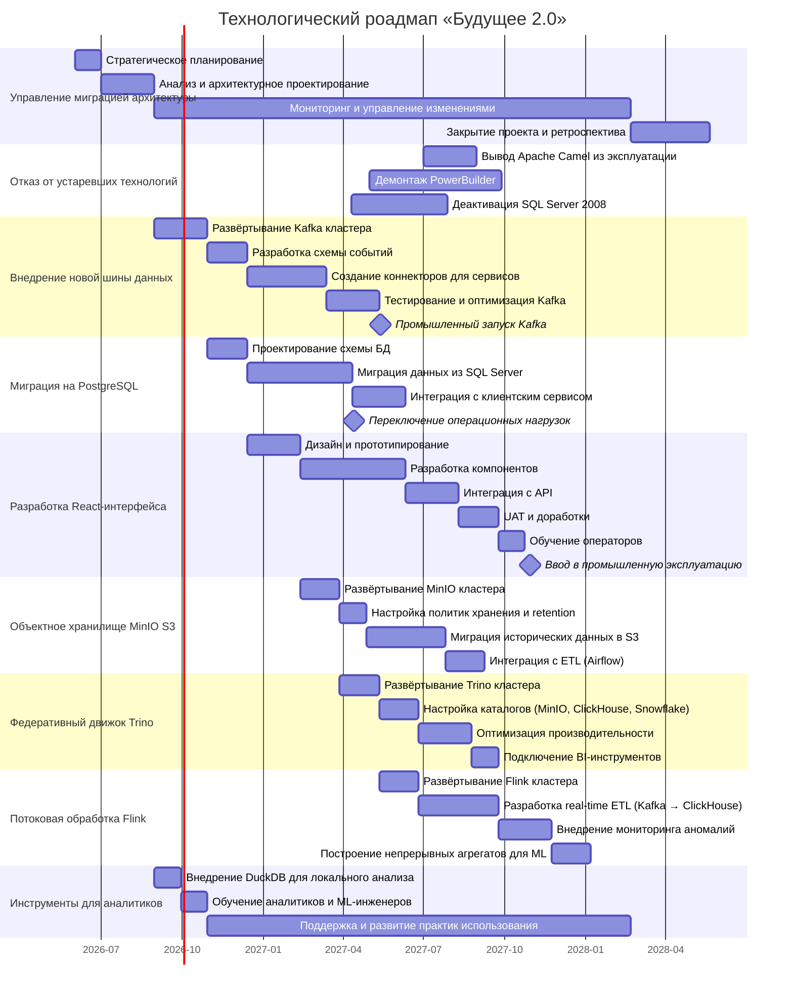

## Технологический радар системы «Будущее 2.0»
> Технологический радар «Будущее 2.0», версия от 2026-02-19

### Изменения технологического ландшафта «Будущее 2.0»

#### Тестируем технологии

- **DuckDB** – лёгкая встраиваемая аналитическая СУБД.  
  *Сценарии*:  
  - Аналитики и ML-инженеры могут исследовать выгрузки из DWH или витрин на своих локальных машинах, не нагружая production-системы.  
  - Промежуточная обработка небольших объёмов данных в ETL-процессах, где требуется скорость колоночного движка без развёртывания отдельного кластера.

- **Minio S3** – объектное хранилище, совместимое с Amazon S3.  
  *Сценарии*:  
  - Организация «холодного» слоя данных: архивирование исторических транзакций и медицинских записей с возможностью дешёвого хранения и последующего доступа.  
  - Хранение сырых событий из шины (Common Bus) в формате Parquet/ORC для последующей обработки через Spark или Presto.  
  - Замена или дополнение текущего объектного хранилища для ML-данных (ML Data), обеспечивая масштабируемость и совместимость с облачными инструментами.

- **PostgreSQL** – реляционная база данных с широкими возможностями.  
  *Сценарии*:  
  - Замена устаревшей SQL Server 2008
  - Операционное хранилище для клиентского сервиса и сервиса платежей для быстрых транзакционных запросов.  
  - Хранение метаданных о пайплайнах Airflow, конфигураций и пользовательских профилей.  

- **Trino** (Presto SQL) – распределённый SQL-движок для федеративных запросов.  
  *Сценарии*:  
  - Выполнение аналитических запросов, объединяющих данные из разных источников: например, медицинские данные из Snowflake, финансовые из ClickHouse и исторические архивы из Minio S3 без необходимости перемещать данные.  
  - Предоставление единой точки доступа для BI-инструментов (Power BI) к данным, хранящимся в различных хранилищах, что упрощает архитектуру и ускоряет разработку отчётов.

- **Облачные сервисы (Cloud Services)** – например, AWS, GCP, Azure с их управляемыми базами данных и аналитическими платформами.  
  *Сценарии*:  
  - Масштабирование отчётности: использование облачных аналитических СУБД (BigQuery, Redshift, Snowflake) для разгрузки локального DWH при росте объёмов данных.  
  - Быстрое подключение новых бизнес-направлений: развёртывание managed-сервисов (Kafka, Airflow, ML платформы) без затрат на собственную инфраструктуру.

- **StarRocks** – высокопроизводительная MPP-база данных для аналитики.  
  *Сценарии*:  
  - Замена или дополнение ClickHouse в финансовом домене для сценариев, требующих ещё более высокой скорости многомерных запросов и поддержки обновлений (upsert).  
  - Построение витрин реального времени для оперативной отчётности руководителей (например, дашборд финансового директора с актуальными показателями за последние минуты).  
  - Унификация аналитической платформы: StarRocks может одновременно обрабатывать детальные и агрегированные данные, упрощая архитектуру.

- **Apache Flink** – фреймворк для потоковой обработки данных.  
  *Сценарии*:  
  - Организация real-time ETL: события из клиентского сервиса и платежей могут обрабатываться Flink «на лету», обогащаться и записываться в витрины (ClickHouse, StarRocks) с минимальной задержкой.  
  - Мониторинг аномалий: выявление подозрительных транзакций или нештатного поведения пациентов в реальном времени с немедленным оповещением.  
  - Построение непрерывных агрегатов для ML-моделей, чтобы данные для обучения всегда были актуальны и поступали потоком.

#### Отказываемся от технологий

1. **Apache Camel (Common Bus)**
	Apache Camel используется в качестве общей шины взаимодействия между сервисами. Однако в контексте современной архитектуры от его использования стоит отказаться по следующим причинам:
	- **Сложность и громоздкость**: Camel представляет собой тяжёлую интеграционную платформу с большим количеством компонентов, что усложняет развёртывание и обслуживание.
	- **Отсутствие нативной поддержки потоковой обработки**: Современные event-driven архитектуры требуют высокой пропускной способности и низких задержек. Apache Kafka или Pulsar обеспечивают надёжное хранение событий, масштабирование и возможность повторной обработки.
	- **Сложности с мониторингом и отладкой**: Camel сложнее интегрировать с современными системами observability (Prometheus, Grafana, Jaeger) по сравнению с Kafka, которая имеет богатую экосистему.
	- **Лицензионные и support-ограничения**: В корпоративной среде поддержка Camel может быть затруднена, тогда как Kafka имеет широкое сообщество и коммерческую поддержку от крупных вендоров.
	Рекомендуемая замена: переход на **Apache Kafka** в качестве высокопроизводительной, отказоустойчивой шины событий с возможностью долговременного хранения и потоковой обработки
	
2. **Power Builder (Клиентский интерфейс оператора)**
	Power Builder — это устаревшая среда разработки клиентских приложений, которая использовалась для создания интерфейса оператора. В новой архитектуре от неё необходимо отказаться по ряду причин:
	- **Технологическое отставание**: Power Builder не поддерживает современные веб-стандарты, затрудняет интеграцию с REST API и не имеет адекватной поддержки для работы в браузере.
	- **Высокая стоимость поддержки**: Специалистов по Power Builder на рынке крайне мало, что увеличивает затраты на сопровождение и замедляет внедрение изменений.
	- **Отсутствие гибкости и масштабирования**: Монолитное десктопное приложение сложно масштабировать и обновлять по сравнению с веб-интерфейсами на React или Angular.
	- **Низкая безопасность**: Устаревшие технологии имеют множество уязвимостей, которые не патчатся производителем.
	Вместо Power Builder целесообразно разработать современный веб-интерфейс на **React**.

### Технологический роадмап «Будущее 2.0»

* [Технологический роадмап «Будущее 2.0»](Future20_roadmap.png)
