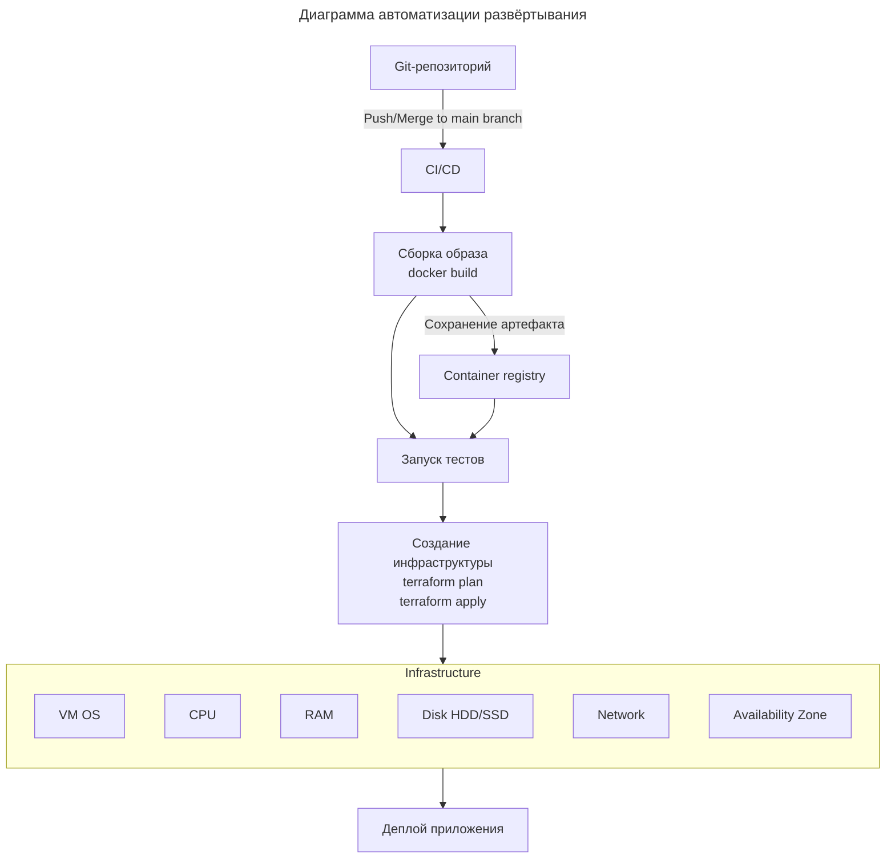

# Диаграмма автоматизации развёртывания



* [Диаграмма автоматизации развёртывания](diagram.png)

# Декларативный подход развёртывания инфраструктуры

**Infrastructure as Code** — это практика управления и обеспечение IT-инфраструктуры (серверы, сети, балансировщики, базы данных, облачные ресурсы) с помощью машинно-читаемых файлов кода.

Terraform имплементирует декларативный подход обеспечение IT-инфраструктуры среды выполнения.

**Особенности декларативного подхода IaC**

|                        | **Декларативный**            | **Императивный**              |
| ---------------------- | ---------------------------- | ----------------------------- |
| Фокус                  | ЧТО нужно получить           | КАК это получить              |
| Состояние              | Описывает желаемое состояние | Описывает шаги для достижения |
| Идемпотентность        | Встроена                     | Нужно реализовывать           |
| Управление изменениями | Автоматическое               | Ручное                        |
| Примеры                | Terraform                    | Ansible                       |

Преимущества декларативного подхода:
  • Простота описания
  • Автоматическое управление состоянием
  • Идемпотентность из коробки
  • Легкий code review
  • Меньше ошибок

Недостатки декларативного подхода:
  • Зависимость от инструмента управления инфраструктурой

## Конфигурация тестового стенда

- **Операционная система:** Ubuntu.
- **Ресурсы:**
    - Количество виртуальных ядер CPU: 2.
    - Объем оперативной памяти RAM: 2 GB.
    - Источник конфигурации ресурсов: файл переменных `variables.tf`.
	- Диск: 20 GB.
- **Сетевая инфраструктура:**
    - Провайдер: Яндекс Облако.
    - Тип сети: подсеть с подключением NAT.
    - Функциональность NAT: перенаправление запросов с внешнего IP-адреса на внутренний IP-адрес в локальной сети подсети.

## Запуск тестового стенда

```bash
winget install HashiCorp.Terraform
yc init
# выяснениие folder_id итп.

terraform init
terraform plan
terraform apply

> terraform apply
data.yandex_compute_image.ubuntu: Reading...
data.yandex_compute_image.ubuntu: Read complete after 3s [id=fd8t9g30r3pc23et5krl]
yandex_compute_disk.testvm: Refreshing state... [id=epda3fd06ducg0ivcsk2]

Terraform used the selected providers to generate the following execution plan. Resource actions are
indicated with the following symbols:
  + create

Terraform will perform the following actions:

  # yandex_compute_instance.testvm will be created
  + resource "yandex_compute_instance" "testvm" {
      + created_at                = (known after apply)
      + folder_id                 = (known after apply)
      + fqdn                      = (known after apply)
      + gpu_cluster_id            = (known after apply)
      + hardware_generation       = (known after apply)
      + hostname                  = (known after apply)
      + id                        = (known after apply)
      + maintenance_grace_period  = (known after apply)
      + maintenance_policy        = (known after apply)
      + metadata                  = {
          + "ssh-keys"  = <<-EOT
                ubuntu:ssh-rsa AAA******@yandex.ru
            EOT
          + "user-data" = null
        }
      + name                      = "app-future-vm"
      + network_acceleration_type = "standard"
      + platform_id               = "standard-v1"
      + status                    = (known after apply)
      + zone                      = (known after apply)

      + boot_disk {
          + auto_delete = true
          + device_name = (known after apply)
          + disk_id     = "epda3fd06ducg0ivcsk2"
          + mode        = (known after apply)

          + initialize_params (known after apply)
        }

      + metadata_options (known after apply)

      + network_interface {
          + index          = (known after apply)
          + ip_address     = (known after apply)
          + ipv4           = true
          + ipv6           = (known after apply)
          + ipv6_address   = (known after apply)
          + mac_address    = (known after apply)
          + nat            = true
          + nat_ip_address = (known after apply)
          + nat_ip_version = (known after apply)
          + subnet_id      = (known after apply)
        }

      + placement_policy (known after apply)

      + resources {
          + core_fraction = 100
          + cores         = 2
          + memory        = 2
        }

      + scheduling_policy (known after apply)
    }

  # yandex_vpc_network.testnet will be created
  + resource "yandex_vpc_network" "testnet" {
      + created_at                = (known after apply)
      + default_security_group_id = (known after apply)
      + folder_id                 = (known after apply)
      + id                        = (known after apply)
      + labels                    = (known after apply)
      + name                      = "app-network"
      + subnet_ids                = (known after apply)
    }

  # yandex_vpc_subnet.testsubnet will be created
  + resource "yandex_vpc_subnet" "testsubnet" {
      + created_at     = (known after apply)
      + folder_id      = (known after apply)
      + id             = (known after apply)
      + labels         = (known after apply)
      + name           = "app-subnet"
      + network_id     = (known after apply)
      + v4_cidr_blocks = [
          + "192.168.10.0/24",
        ]
      + v6_cidr_blocks = (known after apply)
      + zone           = "ru-central1-b"
    }

Plan: 3 to add, 0 to change, 0 to destroy.

Changes to Outputs:
  + instance_ip = (known after apply)
╷
│ Warning: Cannot connect to YC tool initialization service. Network connectivity to the service is required for provider version control.
│
│
│   with provider["registry.terraform.io/yandex-cloud/yandex"],
│   on main.tf line 11, in provider "yandex":
│   11: provider "yandex" {
│
╵

Do you want to perform these actions?
  Terraform will perform the actions described above.
  Only 'yes' will be accepted to approve.

  Enter a value: yes

yandex_vpc_network.testnet: Creating...
yandex_vpc_network.testnet: Creation complete after 3s [id=enp262t5g5fls568e9jm]
yandex_vpc_subnet.testsubnet: Creating...
yandex_vpc_subnet.testsubnet: Creation complete after 1s [id=e2lpk6aah1g6ki822l3b]
yandex_compute_instance.testvm: Creating...
yandex_compute_instance.testvm: Still creating... [00m10s elapsed]
yandex_compute_instance.testvm: Still creating... [00m20s elapsed]
yandex_compute_instance.testvm: Still creating... [00m30s elapsed]
yandex_compute_instance.testvm: Creation complete after 31s [id=epdqk9jneq9oddgfb9v6]

Apply complete! Resources: 3 added, 0 changed, 0 destroyed.

Outputs:

instance_ip = "89.169.172.86"

terraform destroy
```
* [terraform-apply-report.png](terraform-apply-report.png)
